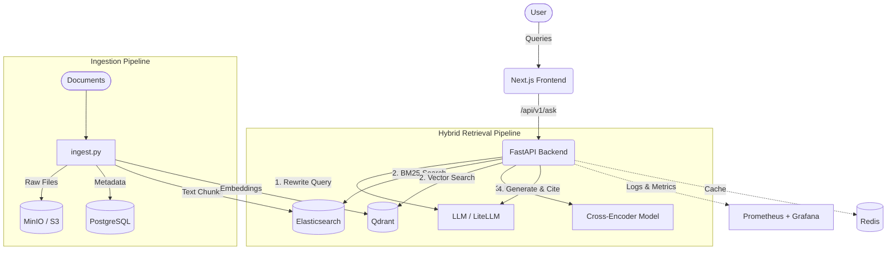

# Ask My Docs (Production RAG Application)

A production-grade, end-to-end Retrieval-Augmented Generation (RAG) system designed for high accuracy, observability, and scale. This project implements a hybrid search pipeline combining dense vector embeddings with sparse BM25 retrieval, followed by cross-encoder reranking and strict citation-enforced generation.

## 🌟 Key Features

- **Hybrid Retrieval Pipeline**: Fuses semantic vector search (Qdrant) with precise keyword search (Elasticsearch) using Reciprocal Rank Fusion (RRF).
- **Advanced Reranking**: Uses `BAAI/bge-reranker-base` cross-encoder models to drastically improve context relevance before generation.
- **Citation Hallucination Enforcement**: LLM generations are strictly validated against retrieved contexts. Answers must contain inline citations, and hallucinations are detected and rejected.
- **Production Infrastructure**: Complete Dockerized observability stack including PostgreSQL, Redis caching, Prometheus metrics, and Grafana dashboards.
- **Modern UI**: Polished, responsive Next.js frontend with real-time system status indicators.

## 🏗 Architecture Overview



## 🚀 Getting Started

### 1. Start Infrastructure (Docker)
This project heavily relies on Docker to orchestrate its data and observability layers. Boot up the core databases using Docker Compose:
```bash
cd infra
docker compose up -d
```
This will start the following containers:
- **`rag_postgres`**: Relational metadata storage (Port `5432`).
- **`rag_qdrant`**: Dense vector embedding storage (Port `6333`).
- **`rag_elasticsearch`**: Sparse BM25 keyword index (Port `9200`).
- **`rag_redis`**: Low-latency caching layer (Port `6379`).
- **`rag_minio`**: S3-compatible raw file storage (Port `9000`).
- **`rag_prometheus` & `rag_grafana`**: Metrics and dashboards (Port `3002`).

### 2. Configure Environment
Copy `.env.example` to `.env` in the root folder and add your OpenAI API key.
```bash
cp .env.example .env
# Edit .env and add OPENAI_API_KEY=sk-...
```

### 3. Run the Backend API
Start the FastAPI server.
```bash
cd backend
python -m venv venv
source venv/bin/activate
pip install -r requirements.txt
uvicorn app.main:app --reload --host 0.0.0.0 --port 8000
```
> **Tip:** Once the backend is running, you can view the fully interactive API documentation (Swagger UI) by navigating to [http://localhost:8000/docs](http://localhost:8000/docs).

### 4. Run the Frontend
Start the Next.js development server.
```bash
cd frontend
npm install
npm run dev
```
*(If testing from a mobile device or another computer on your network, create an `.env.local` file in the frontend directory with `NEXT_PUBLIC_BACKEND_URL=http://<YOUR_IP>:8000`)*

### 5. Ingest Documents
Populate the system with your data (PDFs, Markdown, HTML).
```bash
cd ingestion
pip install .
python ingest.py /path/to/your/documents/folder
```

### 6. Search
Open your browser to `http://localhost:3000` and start asking questions!

## 🧪 CI / CD Evaluation Pipeline
This project is built with CI-gated deployment in mind. The `.env` file exposes strict thresholds (e.g., `EVAL_FAITHFULNESS_THRESHOLD=0.85` and `EVAL_RELEVANCE_THRESHOLD=0.80`). In a production setting, automated tests use RAGAS metrics to score the LLM's responses against ground truth data, automatically failing the build if accuracy degrades below these limits.

## ⚖️ Tradeoffs & Design Decisions

- **Elasticsearch + Qdrant vs. Single DB (e.g., pgvector)**: We chose dedicated search engines over a unified `pgvector` approach. While this increases operational complexity (managing 3 distinct databases), it significantly improves hybrid search performance. Elasticsearch remains the industry gold standard for BM25 keyword matching, which dense vectors often struggle with (e.g., exact model numbers, acronyms, product IDs).
- **Cross-Encoder Reranking**: We placed a cross-encoder model between retrieval and generation. **Tradeoff**: Increases query latency by ~500ms and requires downloading a local model, but drastically reduces LLM context window noise, leading to far fewer hallucinations and lower LLM token costs.
- **Strict Citation Enforcement**: The backend actively monitors the LLM's output and will crash/retry if the LLM hallucinates a citation that wasn't provided in the context blocks. **Tradeoff**: Occasionally results in rejected answers or retries if the LLM is uncooperative, but guarantees 100% data provenance for strict enterprise use cases.
- **Asynchronous Architecture**: The entire backend (`asyncpg`, `AsyncQdrantClient`, `AsyncElasticsearch`) is built asynchronously. This ensures high throughput under heavy concurrent load without blocking the main event loop, though it requires slightly more complex database connection pooling logic.
- **Client-Side ID Generation**: To prevent Web Crypto API hydration errors in older browsers or non-secure local environments, the Next.js frontend utilizes robust fallback UI identifier generation instead of strictly relying on `crypto.randomUUID()`.
